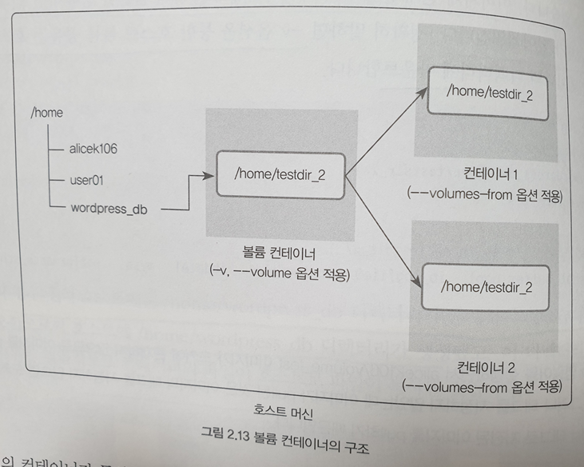

# 도커 엔진
## 도커 이미지와 컨테이너
- 이미지(image) : 컨테이너를 생성할 때 필요한 요소 가상 머신의 iso와 비슷한 개념  
여러 개의 계층으로 된 바이너리 파일로 존재하며, 컨테이너를 생성하고 실행할 때 읽기 전용으로 사용  
[저장소 이름]/[이미지 이름]:[태그]의 형태로 구성  
저장소 이름 : 이미지가 저장된 장소로 default:docker hub  
이미지 이름 : 일반적으로 이미지가 어떤 역할로 명명  
태그 : 이미지의 버전 관리에 사용되며 default:lastest  
```
ex)
alicek106/ubuntu:14.04
ubuntu:lastes
```
  

- 컨테이너(contianer) : 이미지를 사용해 만들어진 독립적인 공간, 파일시스템과 격리된 시스템 자원 및 네트워크를 사용  
컨테이너는 목적에 맞도록 사용되며, 컨테이너의 작업 내용은 이미지에 저장되지 않아 원래 이미지는 영향을 받지 않으며 호스트와도 분리되어 애플리케이션을 설치하거나 삭제해도 다른 컨테이너와 호스트에는 변화가 없음  
  

## 컨테이너 다루기
- docker 버전 확인
```bash
docker -v
```
- 컨테이너  생성  
```bash
docker run -i -t ubuntu:14.04
```
-i -t 옵션은 컨테이너와 상호 입출력을 가능하게 하는 옵션  
- -i : 상호 입출력 옵션 
- -t : tty를 활성화 하여 bash shell을 사용하도록 컨테이너 설정  

docker run은 image가 로컬에 존재하지 않는 경우 자동으로 다운받아 실행
shell이 사용자와 호스트 이름으로 변경된 것을 통해 컨테이너 내부로 들어왔다는 것을 확인  

컨테이너를 종료하고 빠져나오기 위한 방법
1. exit
2. Ctrl + D

컨테이너를 종료시키지 않고 빠져나오는 방법
1. Ctrl + P, Q

컨테이너를 종료하면 작업했던 내용이 모두 삭제되기 때문에 개발을 위해서는 Ctrl + P,Q를 사용  

- 컨테이너 내려받기
```bash
docker pull centos:7
```
run과 달리 이미지를 다운받기만 하는 용도  

- docker images 확인
```bash
docker images
```

- 컨테이너 생성하기
```bash
docker create -i -t --name mycentos centos:7
```
컨테이너를 생성하기 위한 명령어로 --name를 통해서 컨테이너의 이름을 설정하는 것이 가능  
위의 명령어를 실행하는 경우 컨테이너 내부로 들어가지 않는데 run과 달리 create는 컨테이너를 생성하고 컨테이너의 내부로 들어가지는 않음  

- 컨테이너 시작하기
```bash
docker start mycentos
```
start 명령어를 통해 컨테이너 이름으로 지정했던 mycentos를 실행

- 컨테이너 들어가기
```bash
docker attach mycentos
```
컨테이너 내부에 접속  

일반적으로는 하나의 단계씩 진행하지 않고 docker run을 통해 이미지를 다운받는 것부터 시작하고 컨테이너 내부에 들어가는 것까지 하나의 명령어로 실행  

컨테이너의 이름을 지정하지 않는 경우 컨테이너는 임의의 id를 가지며 임의의 id중 일부만 사용하여 컨테이너에 대한 명령을 실행  

- 컨테이너 목록 확인
```bash
docker ps
```
정지되지 않은 목록만 확인할 수 있으며, 정지된 컨테이너까지 모두 확인하려는 경우 -a 옵션 사용

- 컨테이너 삭제
```bash
docker rm
```
현재 실행중이지 않은 컨테이너를 삭제하는 명령어로 삭제하고자 하는 경우 컨테이너를 중지한 후 삭제를 진행하거나 강제로 삭제하기 위해 -f 옵션을 사용

- 사용중이지 않은 모든 컨테이너 삭제
```bash
docker container prune
```

- 컨테이너 중지
```bash
docker stop
```

- 명령어 조합을 이용하여 docker 컨테이너 제거
```bash
docker stop $(docker ps -a -q)
docker rm $(docker ps -a -q)
```

- 컨테이너 내부에서 명령어 실행
```bash
docker exec -i -t [container id or name] [command]
```

- 컨테이너를 외부에 노출
컨테이너는 VM과 마찬가지로 가상 IP를 할당받으며, 이는 기본적으로 외부에 노출되지 않아 통신할 수 없는 상태이다. 외부에 컨테이너의 애플리케이션을 노출하기 위해서는 eth0의 IP와 port를 host의 IP와 port를 바인딩 해야함
```bash
docker run -i -t --name mywebserver -p 80:80 ubuntu:14.04
```
-p 옵션을 사용해 컨테이너의 80번 포트와 호스트의 80번 포트를 연결  
[호스트의 포트]:[컨테이너의 포트] 형식으로 사용  

### 컨테이너 애플리케이션 구축
- 대부분의 서비스는 단일 프로그램으로 동작하지 않으며 에이전트나 DB의 연결을 통해 서비스로 동작하는 것이 일반적  
- 이런 서비스를 컨테이너화(containerize)할 때 여러 개의 애플리케이션을 한 컨테이너에 설치하는 것도 가능  
- 하나의 컨테이너에 여러 개의 애플리케이션을 구성하는 경우 독립성을 유지하기 어려움 
- 하나의 컨테이너에 하나의 애플리케이션을 올리는 것을 docker에서도 권장  

두 개의 컨테이너를 띄워 이를 연결하는 방법을 확인
```bash
# mysql container
docker run -d \
--name wordpressdb \
-e MYSQL_ROOT_PASSWORD=password \
-e MYSQL_DATABASE=wordpress \
mysql:5.7
```
```bash
# wordpress container
docker run -d \
-e WORDPRESS_DB_HOST=mysql \
-e WORDPRESS_DB_PASSWORD=password \
--name wordpress \
--link wordpressdb:mysql \
-p 80 \
wordpress
```
wordpress의 경우 -p로 80의 옵션만 사용, 이렇게 사용하는 경우 호스트의 80번 포트로 container의 임의의 포트로 연결되며, docker ps 명령어로 확인 가능  

docker run에서 사용한 명령어인 -d, -e, --link의 옵션에 대해서 살펴보면
- -d : 컨테이너를 백그라운드에서 동작하는 애플리케이션으로 실행하도록 설정  
-it 옵션을 사용하는 경우 컨테이너의 내부로 들어가 명령어를 실행하는 것에 반해 -d 옵션은 이미지단에서 설정된 애플리케이션이 백그라운드에서 동작하게 하기 위한 옵션
- -e : 컨테이너 내부에서 사용하는 환경변수에 대한 설정을 위한 옵션
- --link : 컨테이너간 통신을 위해 네트워크에서의 hostname을 설정하는 것과 비슷한 역할 link를 이용해 설정한 이름을 통해 컨테이너간 통신이 가능  
두번째 docker 예제에서 wordpress 컨테이너는 wordpressdb 컨테이너를 mysql 컨테이너로 인식 단, 컨테이너가 실행중이지 않거나 존재하지 않으면 실행하고자 하는 컨테이너도 실행할 수 없음  
--link명령어는 아직 존재하나 deprecated 될 옵션이며, 브리지 네트워크를 사용하여 컨테이너간 통신을 좀 더 쉽게 설정할 수 있음  

### 도커 볼륨
도커 이미지에서 컨테이너를 생성하는 경우 이미지는 읽기 전용이 되며 컨테이너의 변경 사항만 별도로 저장해 각 컨테이너의 정보를 보존  
앞서 wordpress와 mysql의 경우 컨테이너가 종료되면 기존의 데이터가 모두 제거  
컨테이너의 데이터를 보존하기 위해 몇 가지 방법이 존재
1. 호스트와 볼륨 공유
2. 볼륨 컨테이너 활용
3. 도커가 관리하는 볼륨 생성

#### 호스트 볼륨 공유
```bash 
docker run -d \
--name wordpressdb_hostvolume \
-e MYSQL_ROOT_PASSWORD=password \
-e MYSQL_DATABASE=wordpress \
-v /home/wodpredss_db:/var/lib/mysql \
mysql:5.7
```
```bash
docker run -d \
-e WORDPRESS_DB_HOST=mysql \
-e WORDPRESS_DB_PASSWORD=password \
--name wordpress_hostvolume \
--link workpressdb_hostvolume:mysql \
-p 80 \
wordpress
```
-v 옵션을 통해 호스트와 볼륨을 공유할 수 있으며 -p 옵션과 동일하게 [호스트의 공유 디렉토리]:[컨테이너의 공유 디렉토리]  
위의 경우 만약 /home/wordpress_db가 존재하지 않는다면 디렉토리가 생성  
이렇게 공유된 볼륨은 컨테이너가 사라진 후에도 보존  
디렉토리 단위 뿐만 아니라 파일 단위도 가능하며 -v 옵션을 여러 개 사용하는 것도 가능  
호스트와 컨테이너 모두에 디렉토리가 있는 경우 호스트의 디렉토리가 컨테이너의 디렉토리에 덮어써짐

#### 볼륨 컨테이너
-v 옵션을 사용해 컨테이너를 다른 컨테이너와 공유하는 것으로 --volumes-from 옵션을 설정하면 -v(--volume) 옵션을 적용한 컨테이너의 볼륨 디렉토리를 공유  
여러 개의 컨테이너에 대해 설정하는 것이 가능하며, 하나의 컨테이너를 볼륨 컨테이너로 사용하는 것이 가능  
  

#### 도커 볼륨
도커 자체에서 제공하는 기능인 docker volume 명령어를 사용하여 데이터를 보존하는 방법
```bash
# docker volume 생성
docker volume create --name myvolume
# docker volume 확인
docker volume ls
```

volume로 여러 스토리지 백엔드를 사용 가능  
-v 옵션으로 [볼륨 이름]:[컨테이너의 공유 디렉토리] 형식으로 사용  

위에서 살펴본 3가지 컨테이너가 아닌 외부에 데이터를 저장하고 그 데이터를 기반으로 동작하도록 설계하는 것을 **스테이트리스(stateless)** 하다고 하며 반대로 컨테이너에서 데이터를 저장하고 있는 경우를 **스테이트풀(stateful)** 이라고 함  
  

## 도커 네트워크

