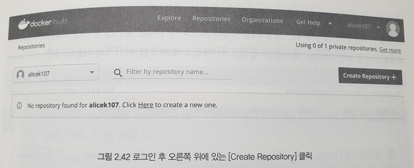

# 도커 이미지
## 도커 이미지 생성
- 컨테이너 내부에 first라는 이름의 파일 생성
```
docker run -i -t --name commit_test ubuntu:14.04
root@acc525940263:/# echo test_first! >> first
```
 - docker commit 명령어
```
docker commit [OPTIONS] CONTATINER [RESPOSITORY[:TAG]]
ex) docker commit -a "alicek106" -m "my first commit" commit_test commit_test:first
```
옵션
-a : author 이미지작성자 표기
-m : 커밋메시지

```
docker run -i -t --name commit_test2 commit_test:first
root@acc525940263:/# echo test_second! >> second
docker commit -a "alicek106" -m "my second commit" commit_test2 commit_test:second
``` 
 - docker images 명령어로 생성되었는지 확인
 
 

## 이미지 구조 이해
도커 이미지를 좀더 효율적으로 다루기 위해 컨테이너가 어떻게 이미지로 만들어지며,
이미지의 구조에대한 이해필요

 - inspect명령어는 컨테이너 뿐만아니라 네트워크, 볼류므 이미지 등 모든 도커 단위의 정보를 얻을때 사용
```
docker inspect ubuntu:14.04
docker inspect commit_test:first
docker inspect commit_test:second
```
- docker 히스토리
 ```
 docker history commit_test:second
 ```
 - docker 이미지 삭제
 ```
 docker rmi commit_test:first
 ```

- 댕글링 이미지 : docker rmi -f 로 강제로 삭제하면 docker 이미지의 이름이 none인 이미지
- 사용중이지 않은 댕글링 이미지 삭제
```
 docker image prune
```
## 이미지 추출
도커 이미지를 별도로 저장하거나 옮기는등 필요에 따라 이미지를 단일 바이너리 파일로 저장해야함.
이때 docker save 명령어를 사용해 파일을 추출할수있음

- 이미지 추출
```
 docker save -o ubuntu_14_04.tar ubuntu:14.04
```

- 추출된 이미지 로드
```
 docker load -i ubuntu_14_04.tar
```

- import,export 명령어로 이미지 추출 및 저장
```
 docker export -o rootFS.tar mycontainer
 docker import rootFS.tar myimage:0.0
 ```

## 이미지 배포
 이미지 배포하는 방법은 두가지가있다.
 1. 도커 허브 이미지 저장소를 사용 (docker push,pull을 사용), 단 비공개 저장소에는 제한이있어 결제를 해야돰
 2. 도커 사설 레지스트리를 사용 (사용자가 직접 이미지 저장소 및 사용되는 서버, 저장공간 관리)
 
 - 도커 허브 저장소  : https://hub.docker.com
 
 1.도커 허브 저장소 접속후 가입후 이미지 저장소 생성  
 
 2.저장소 생성
 
 3.생성 완료
 
 
 저장소에 이미지 올릴 이미지 생성
```
docker run -i -t --name commit_container1 ubuntu:14.04
echo my first push >> test

docker commit commit_container1 my-image-name:0.0
```

특정 이름의 저장소에 이미지를 올리려면 저장소 이름을 이미지 앞에 접두어로 추가해주어야함
이를 가능케하는게 docker tag명령어
```
ex) docker tag [기존의 이미지 이름][새롭게 생성될 이미지 이름]
docker tag my-image-name:0.0 alicek107/my-image-name:0.0
```

```
#docker 로그인/로그아웃 명령어
docker login/logout

#docker push 명령어
docker push alicek107/my-image-name:0.0

#docker pull 명령어
docker pull alicek107/my-image-name:0.0
```

### 도커 허브 조직 팀 생성
Create Organization에서 Create Team으로 팀을 생성하면 read,write권한 부여 가능

### 저장소 웹훅 추가 
저장소에 이미지가 push됐을때 특정 URL로 http 요청을 전송하도록 설정해주는 기능

### 도커 사설 레지스트리 
```
#도커 사설 레지스트리 생성
docker run -d --name myregistry -p 5000:5000 --restart=always registry:2.6
#컨테이너 정상작동 확인용 예시
curl localhost:5000/v2/
```
사설 레지스트리에 이미지 push
```
docker tag my-image0name:0.0 ${DOCKER_HOST_IP}:5000/my-image-name:0.0
```

## Dockerfile 
### 이미지 생성하는 방법
1.아무것도 존재하지 않는 이미지(Ubuntu, CentOS)로 컨테이너 생성
2.애플리케이션을 위한 환경을 설치하고 소스코드 등을 복사해 잘 동작하는것을 확인
3.컨테이너를 이미지로 커밋

1번으로 dockerfile을 구성하기위해 일일이 수작업으로 설치해야되서 
보통 3번의 방법으로 사용하는것같음 

### DockerFile 
: Dockerfile에 손쉽게 기록하고 수행할 수 있는 빌드 명령어를 제공하여 패키지, 소스코드, 셸스크립트등을 파일에 기록해두면 도커는 이파일을 읽음  
  빌드 명령어는 Dockerfile을 읽어서 이미지를 생성
- Dockerfile을 사용하면 직접 컨테이너를 생성하고 커밋하는 번거로움은 있지만, 깃과같은 개발도구를 통해 애플리케이션의 빌드 및 배포를 자동화할수있다.

### DockerFile 작성
```
#도커파일생성
mkdir dockerfile && cd dockerfile
echo test >> test.html

#아파치 웹 서버가 설치된 이미지를 빌드하는 Dockerfile
vi Dockerfile

FROM ubuntu:14.04
MAINTAINER alicek106
LABEL "purpose"="practice"
RUN apt-get update
RUN apt-get install apache2 -y
ADD test.html /var/www/html
WORKDIR /var/www/html
RUN ["/bin/bash","-c","echo hello >> test2.html"]
EXPOSE 80
CMD apachectl -DFOREGROUND
```
- -FROM : 생성할 이미지의 베이스가 될 이미지를 뜻합니다.  
FROM 명령어는 DockerFile을 작성할때 반드시 한번이상 입력해야함  
이미지의 이름의 포맷은 docker run 명령어에서 이미지 이름을 사용할때와같다.  
사용하려는 이미지가 도커에 없다면 자동으로 pull
- -MAINTAINER : 이미지를 생성한 개발자의 정보를 나타냅니다.  
일반적으로 DockerFile을 작성한 사람과 연락할 수 있는 이메일등을입력함  
단, MAINTAINER는 도커 1.13.0 버전 이후로는 사용하지않음  
```
#maintainer 교체방법
LABEL maintainer "alicek106 <alicek106@naver.com>"
```
- -LABEL : 이미지에 메타데이터를 추가합니다.  
메타데이터는 "키:값"의 형태로 저장되며 여러개의 메타데이터가 저장될수있다.  
확인은 docker inspect명령어로 확인
- -RUN : 이미지를 만들기 위해 컨테이너 내부에서 명령어를 실행  
- -ADD : 파일을 이미지에 추가합니다.  
추가하는 파일은 Dockerfile이 위치한 디렉터리인 Context에서 가져옵니다.
- -WORKDIR : 명령어를 실행할 디렉터리를 나타냅니다.  
배시 셸에서 CD 명령어를 입력하는것과 같은 기능을함
```
#WORKDIR명령어를 여러번 사용하면 cd명령어를 여러번 사용한것과같음.
WORKDIR /VAR
WORKDIR www/html
```
 
 - -EXPOSE : Dockerfile의 빌드로 생성된 이미지에서 노출할 포트를 설정
 - -CMD : CMD는 컨테이너가 시작될 때마다 실행항 명령어를 설정,  
 Dockerfile에서 한번만 사용할수있다.
 
 ## DockerFile 빌드
 ### 이미지 생성
```
#빌드 명령어
docker build -t mybuild:0.0 ./

#컨테이너 실행
docker run -d -P --name myserver mybuild:0.0 

#컨테이너 확인
docker port myserver
docker images --filter "label=purpose=practice"
```

캐시를 이용한 이미지 빌드
```
#캐시도커파일 생성
vi Dockerfile2
FROM ubuntu: 14.03
MAINTAINER alicek106
LABEL "purpose"="practice"
RUN apt-get update

#위에만든 이미지 빌드
docker build -f Dockerfile2 -t mycache:0.0
```
캐시를 사용하지않고 빌드
```
docker build --no-cache -t mybuild:0.0
```

### 멀티스테이지를 이용한 Dockerfile 빌드
예시 1)
```
#Dockerfile을 통해 컴파일될 main.go 파일의 내용
package main
import "fmt"
func main() {
fmt.Println("hello world")
}

#golang 이미지를 기반으로 main.go를 컴파일하고 출력 프로그램을 실행하는 Dockerfile
FROM golang
ADD main.go /root
WORKDIR /root
RUN go build -o /root/mainApp /root/main.go
CMD ["./mainApp"]

#위의 Dockerfile빌드
docker build . -t go_helloworld
#도커 이미지 확인
docker images
```

예시 2)
```
#멀티스테이지 빌드사용법
FROM golang
ADD main.go /root
WORKDIR /root
RUN go build -o /root/mainApp /root/main.go

FROM alpine:latest
WORKDIR /root
COPY --from=0 /root/mainApp .
CMD ["./mainApp"]

#위의 Dockerfile빌드
docker build . -t go_helloworld:multi-stage
#도커 이미지 확인
docker images
```

이외 빌드 옵션들이 필요하다면 : https://docs.docker.com/engine/reference/builder


## ENTRYPOINT와 CMD
두 명령어 모두 컨테이너가 시작될 때 실행할 명령어 설정  

### CMD 
- 단순 명령어를 실행
- 아래의 예제의 경우 CMD로 /bin/bash명령어가 실행되어 컨테이너의 bash shell로 연결
```bash
# entrypoint: 없음, cmd: /bin/bash
docker run -i -t --name no_entrypoint ubuntu:14.04 /bin/bash
```

### ENTRYPOINT
- command를 인자로 받아 사용할 수 있는 스크립트 역할을 할 수 있음
- 아래의 경우 entrypoint로 echo를 설정하고 CMD를 /bin/bash로 전달
- 여기서 /bin/bash는 command형태로 사용되는 것이 아니고 ENTRYPOINT와 조합하여 'echo /bin/bash' 형식으로 전달
- container의 bash shell로 연결되지 않고 /bin/bash가 출력
```bash
# entrypoint: echo, cmd: /bin/bash
docker run -i -t --entrypoint="echo" --name yes_entrypoint ubuntu:14.04 /bin/bash
```
