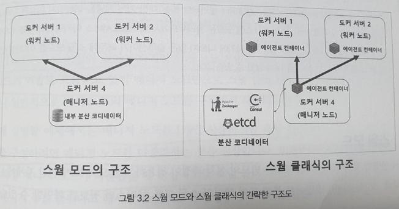
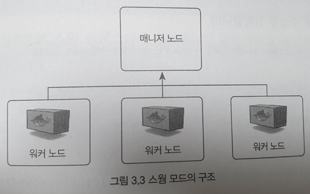
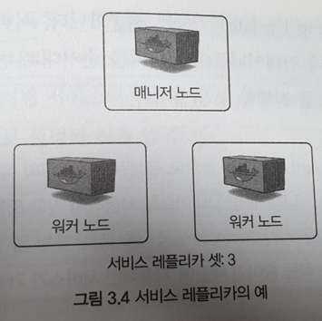
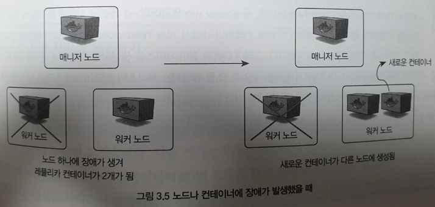
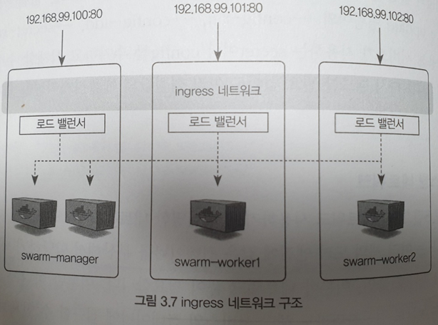
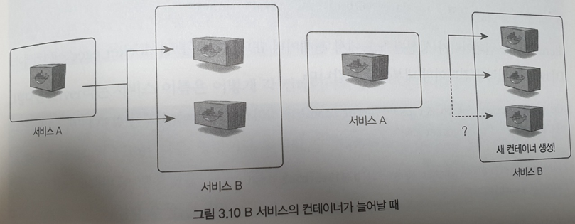

# 도커 스웜(docker swarm)
## 도커 스웜을 사용하는 이유
앞서 알아본 docker은 모두 하나의 호스트를 기준으로 동작  
ps, create, run 등도 모두 local에서 컨테이너를 생성하여 동작시키는 명령어  
하지만 실제로 docker을 사용하는 경우 하나의 호스트에서 docker 사용하면 자원적으로 문제가 발생할 가능성이 존재, 이를 해결하기 위한 방법으로 성능이 좋은 서버를 구매하는 방법도 있지만, 여러 대의 서버를 클러스터로 만들어 자원을 병렬적으로 확장하는 방법을 많이 사용  
  

그러나 여러 대의 서버를 하나의 자원 풀로 만들어 사용하는 것은 쉽지 않은 작업
- Service Discovery : 어떤 서버에 컨테이너를 할당할 것인가
- 스케쥴러
- 로드밸런서
- 클러스터 내의 서버가 다운됐을 때 고가용성(HA)

등 다양한 문제가 존재하는데 이러한 문제를 해결해주는 도커 스웜과(docker swarm)과 docker swarm mode가 존재  

## 스웜 클래식과 도커 스웜 모드
스웜 클래식과 스웜 모드는 모두 스웜 모드는 모두 도커 스웜을 이야기 하지만 도커 1.6 이후와 1.12 이후로 나누어 부르며 1.6 이후부터 제공되는 도커 스웜을 스웜 클래식, 1.12 이후로 제공되는 도커 스웜을 스웜 모드라고 부르며 책에서 이야기하는 내용은 대부분 스웜 모드

스웜 클래식과 스웜 모드의 공통점
- 여러 대의 노드를 하나의 클러스터로 만들어 컨테이너를 생성하는 여러 기능을 제공

#### 스웜 클래식과 스웜 모드의 차이점
스웜 클래식  
- 스웜 클래식은 여러 대의 도커 서버를 하나의 지점에서 사용하도록 단일 접근점 제공
- 스웜 클래식은 run, ps 등의 일반적인 도커 명령어와 API로 클러스터의 서버를 제어하고 관리할 수 있는 기능 제공

스웜 모드
- 스웜 모드는 마이크로서비스 아키텍처의 컨테이너를 다루기 위한 클러스터링 기능에 초점
- 같은 컨테이너를 동시에 여러 개 생성해 필요에 따라 유동적으로 컨테이너 수를 조절
- 컨테이너로의 연결을 분산하는 로드 밸런싱 기능 지원
- 각종 정보를 저장하고 동기화하는 코디네이터, 클러스터 서버를 관리하고 제어하는 매니저, 서버를 제어하는 에이전트 제공

  

## 스웜 모드
- 매니저 노드
  - 워커 노드를 관리하기 위한 도커 서버
  - 실제로 컨테이너가 동작하기도 함
  - 클러스터 내 1대 이상 존재
  - 매니저의 부하 분산과 매니저가 다운되는 경우 도커 스웜이 정상적으로 동작하지 않을 수 있으므로 다중화 권장
  - 매니저 노드 혹은 파티셔닝 등에 문제가 발생했을 때 새로운 매니저 선출을 위해 과반수로 결정하는데 이를 위해 매니저 노드를 홀수로 유지하는 것을 권장
  - 리더 매니저와 일반 매니저 노드로 나뉨
- 워커 노드
  - 컨테이너가 생성되고 관리되는 도커 서버
  - 클러스터 내 한대도 동작하지 않을 수 있음



## 도커 스웜 모드 클러스터 구축
```bash
# 스웜에 새로운 노드 추가
# 여기서 사용되는 token은 외부에 노출되지 않도록 하는 것이 중요한대, 노출되는 누구든 클러스터에 노드를 추가하는 등 보안적인 문제가 발생할 수 있음
docker swarm join --token [token]

# 추가 노드 확인
docker node ls

# 매니저 노드 추가
docker swarm join-token manager \
docker swarm join --token [token]

# 워커 노드 삭제
# 워커 노드 삭제시 매니저 노드는 상태를 DOWN으로 인식할 뿐 워커 노드를 삭제하지 않음
docker swarm leave

# 워커 노드 제거
docker node rm [node id]

# 매니저 노드 삭제
docker swarm leave --force

# 워커 노드 -> 매니저 노드 변경
docker node promote

# 매니저 노드 -> 워커 노드 변경
docker node demote
```

## 스웜 모드 서비스
스웜 모드에서 제어하는 하나의 단위로 컨테이너의 집합을 말하며, 서비스를 제어하면 서비스 내의 컨테이너에 같은 명령이 수행, 서비스 내에 컨테이너는 1개 이상 존재할 수 있으며, 컨테이너들은 각 워커 노드와 매니저 노드에 할당되고 이렇게 할당된 컨테이너를 태스크(Task)라고 한다.  
    

서비스는 레플리카를 지정할 수 있으며 스웜 스케쥴러는 서비스 정의에 따라 컨테이너를 할당할 노드를 선정하고 노드에 컨테이너를 분산하여 할당하며, 노드별로 꼭 하나의 컨테이너가 할당되지는 않음. 레플리카는 서비스에 할당된 수 만큼의 컨테이너를 항상 유지하며, 레플리카 수만큼 컨테이너가 존재하지 않는 경우 새로운 컨테이너를 생성하여 레플리카 수를 유지  
    

### 서비스 생성
서비스를 제어하는 등의 명령어는 모두 **매니저 노드** 에서만 가능
서비스 모드에는 복제 모드(replicated)와 global모드가 존재  

복제 모드
- 지정한 수만큼의 replicas 수 유지
- 
글로벌 모드
- 모든 node에 컨테이너를 반드시 하나씩 생성
- replica 수를 지정할 수 없음
```bash
# 서비스 생성
docker service create
--replicas 2 \ # replicas 수 지정
--p 80:80 \ # 호스트의 80 port와 service의 80포트 연결, 스웜 클러스터의 어떤 노드에 접근해도 동일
 [image]

# 서비스 목록 확인
docker service ls

# 서비스 정보 상세 확인
docker service ps [서비스 이름]

# 서비스 삭제
docker service rm [서비스 이름]

# replicas 조정
docker service scale [서비스 이름]=[replicas 수]

# 글로벌 서비스 생성
docker service create \
-- mode global
```

#### 서비스 생성시 주의사항
서비스 컨테이너는 모두 detached 모드로 생성되어 docker run -d 명령어를 사용하는 것과 같으므로 컨테이너 내부를 차지하고 있는 프로세스가 없는 경우 스웜 매니저는 서비스 컨테이너에 장애가 생긴 것으로 판단해 컨테이너를 반복 생성할 수 있음

### 서비스 롤링 업데이트
스웜 모드는 자체적으로 롤링 업데이트와 롤백 기능을 제공 롤백 기능을 통해 내부적으로 이미지나 업데이트가 일어나는 경우에도 중단없이 배포하는 것이 가능  
롤링 업데이트 관련 옵션은 서비스를 최초에 생성하는 경우 설정할 수 있으며, 업데이트의 주기, 동시에 진행할 컨테이너 수, 실패 했을 때의 처리방법 등에 대해 설정  
```bash
# 롤링 업데이트 관련 설정
docker  service create \
--update-delay 10s # 업데이트 주기 10초로 설정
--update-parallelism 2 # 컨테이너 2개씩 업데이트 진행
--update-failure-action # 업데이트 실패시 처리 방안 pause = 중단, continue = 진행
[image]

# 서비스 이미지 업데이트
docker service update \
--image [image]
[service name]

# 서비스 이미지 롤백
docker service rollback [service name]
```

### 서비스 컨테이너에 설정 정보 전달하기 : config, secret
애플리케이션과 공통적으로 사용해야 하는 설정 파일이나 값들을 사용하기 위한 설정 항목으로 ID, PW등 중요한 정보나 간단한 설정값 같은 것을 공유하기 위한 목적으로 사용  
docker에서 사용한 방식과 같이 파일을 공유하여 사용하기에는 비효율적이며, 보안 정보는 이렇게 관리하는 것이 바람직하지 않음  
도커 스웜에서는 **secret** , **config** 를 사용할 수 있으며 secret는 비밀번호나 SSH키 인증서 키와 같이 보안에 민감한 데이터를 전송하기 위한 목적으로 사용하고 config는 설정 파일과 같이 암호화가 필요없는 설정 파일에 대해 사용 가능  
```bash
# secret 생성하기
docker secret create [key]

# secret 확인하기
docker secret ls

# 서비스 생성시 추가
docker service create \
...
--secret source=[service_key], targer=[컨테이너 내부에 저장될 파일명]
-e MYSQL_ROOT_PASSWORD_FILE="/run/secrets/mysql-root-password"
...

# config 생성
docker config create [config-key] config.yml

# config 확인
docker config ls

# 서비스 생성시 추가
docker service create \
...
--config source=[config-key], target=[컨테이너 내부에 저장될 파일명]
...
```
secret는 외부에서 확인할 수 있는 방법이 없이 암호화되어 저장되고, config는 base64로 인코딩되어 base64로 디코딩하면 값을 확인할 수 있음

secret는 기본적으로 컨테이너 내부의 /run/secrets/에 마운트  
이렇게 사용하는 경우 컨테이너 내부의 애플리케이션이 특정 경로의 파일값을 참조할 수 있도록 설계할 필요가 있음  

## 도커 스웜 네트워크
스웜 모드에서는 스웜에 묶인 여러 노드들이 하나의 네트워크로 묶여 관리되어야 하며, 이를 네트워크 풀이라고 함. 네트워크 풀은 서비스를 외부로 노출했을 때 어느 노드로 접근하더라도 해당 서비스의 컨테이너에 접근할 수 있게 라우팅 기능이 필요하며 스웜에서는 이 기능을 제공  

### ingress 네트워크
스웜 클러스터를 생성하는 경우 자동으로 등록되는 네트워크  
  
ingress 네트워크는 어떤 스웜 노드에 접근하더라도 서비스 내의 컨테이너에 접근할 수 있게 설정하는 라우팅 메시를 구성하고, 서비스 내의 컨테이너에 대한 접근을 하는 라운드로빈 방식으로 분산하는 로드 밸런싱을 담당  
```bash
docker service create --name hostname \
-p 80:80 \
--replicas=4 \
[이미지]
```

스웜 모드를 사용하는 경우 ingress 네트워크만을 사용해야 하는 것은 아니며, docker run -p를 사용해 외부에 컨테이너를 노출했던 것처럼 호스트의 특정 포트를 사용하도록 설정하는 것도 가능
```bash
docker service create \
--publish mode=host, target=80, published=8080, protocol=tcp \
--name web \
[이미지]
```  

그러나 위와 같이 ingress 네트워크를 사용하지 않고 위와 같이 서비스를 외부로 노출할 경우 어떤 호스트에서 컨테이너가 생성될지 알 수 없어 포트 및 서비스 관리가 어렵다는 단점이 있음  

### 오버레이 네트워크
오버에이 네트워크는 여러 개의 도커 데몬을 하나의 네트워크 풀로 만드는 가상화 기술로 여러 도커 데몬에 존재하는 컨테이너가 서로 통신이 가능, 여러 개의 스웜 노드에 할당된 컨테이너는 오버레이 네트워크의 서브넷에 해당하는 IP 대역을 할당받고 이 IP를 통해 서로 통신할 수 있다.

### docker_gwbridge 네트워크
오버레이 네트워크를 사용하지 않는 컨테이너는 기본적으로 존재하는 브리지(bridge) 네트워크를 사용해 외부와 연결  

### 서비스 디스커버리
같은 역할을 하는 컨테이너를 여러 개 만들어 사용할 때 쟁점이 되는 부분 중 하나는 새로 생성된 컨테이너 생성의 발견 및 없어진 컨테이너의 감지이다.
  
서비스 A에서 서비스 B로 연결하고자 하는 경우 서비스 B의 container이 몇개로 늘어나거나 줄어들거나 상관없이 A에서는 단순히 B로 연결만 하면 되는데, 이렇게 제공해주는 기능을 서비스 디스커버리라고 한다.  

## 스웜 모드 볼륨
도커 데몬 명령어 중 run에서 -v 옵션을 사용하여 호스트와 디렉터리를 공유하는 경우 볼륨을 사용하는 경우에 대한 구분은 딱히 없었지만 도커 스웜에서는 조금 다르게 사용된다.  

### 도커 스웜에서의 볼륨 
서비스를 생성할 때 지정  
```bash
docker service create --name ubuntu \
--mount type=[type],source=[source dir],target=[target dir]
```
- volume 타입
  - type=volume로 설정
  - source는 사용할 볼륨, target는 컴테이너 내부에 마운트될 디렉터리 위치
- bind 타입
  - 공유될 호스트의 디렉터리 설정
  - source에 대한 부분이 반드시 필요

#### 볼륨의 한계점
서비스를 할당받을 수 있는 모든 노드가 볼륨 데이터를 가지고 있어야 하기 때문에 컨테이너를 할당해도 노드에 볼륨이 없는 경우 볼륨을 사용할 수 없는 상황이 발생할 수 있음

- Persistent Storage
  - 호스트와 컨테이너와 별개로 외부에 존재하여 네트워크로 마운트할 수 있는 스토리지
  - 볼륨의 한계점을 극복
  - nfs, dfs 등을 사용하여 별도로 구성하는 등의 작업 필요

