# 쿠버네티스 시작하기

## 레플리카셋(Replica Set) : 일정 개수의 포드를 유지하는 컨트롤러
앞서 쿠버네티스의 기본 단위인 pod에 대해 살펴보았는데, pod가 종료되는 경우 어떻게 될까?  
일단 pod를 종료시키는 방법에 대해서 알아보자.  
```bash
kubectl delete -f nginx-pod-with-ubuntu.yaml
kubectl delete pods  my-nginx-pod
```
위와 같은 명령어를 사용하면 pod가 종료되는데, 서비스에서 pod를 사용하는 경우 외부 요인에 의해 pod가 종료되지 않도록 하는 것이 중요하다.  
이를 Replica Set을 이용해 구성하는 것이 가능하며 Replica Set는 아래와 같은 특징을 가진다.
- 정해진 수의 동일한 포드가 항상 실행되도록 관리
- 노드 장애 등의 이유로 포드를 실행할 수 없다면 다른 노드에서 포드를 다시 생성
Replica Set를 사용하면 동일한 Nginx pod를 안정적으로 여러 개 운영하는 것이 가능하며, 노드에 장애가 발생하는 경우에도 정해진 개수의 pod를 자동으로 유지

### Replica Set 사용하기
```yaml
apiVersion: apps/v1
kind: ReplicaSet
metadata:
  name: replicaset-nginx
spec:
  replicas: 3
  selector:
    matchLabels:
      app: my-nginx-pods-label
  template:
    metadata:
      name: my-nginx-pod
      labels: 
        app: my-nginx-pods-label
    spec:
      containers:
      - name: nginx
        image: nginx:latest
        ports:
        - containerPort: 80
```
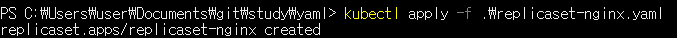  
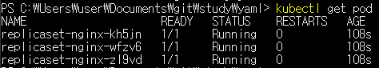  

yaml 파일의 내용중 spec.template를 기준으로 위쪽은 Replica Set에 대한 정의를 나타내며 아래쪽은 pod에 대한 정의를 나타낸다.  
spec.replicas에 정의된 값으로 pod가 유지될 갯수를 정의하게 된다.  
Replica Set의 replicas를 4로 변경하는 경우 어떻게 될까
pod를 4개 띄우는 예제를 통해 살펴보도록 하자.
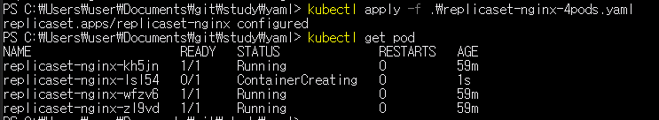  
replicas가 4로 지정된 yaml을 적용시키면 pods가 4개 동작하는 것을 확인할 수 있다.  
마지막으로 실습에 사용한 Replica Set을 삭제해보자.  
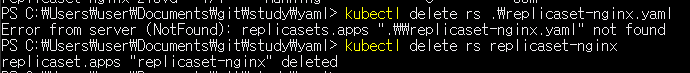  

### Replica Set의 동작 원리
Replica Set을 생성하면 pod가 생성되고, Replica Set을 삭제하면 pod가 삭제되어 서로 연결된 것처럼 보이지만 실제로는 그렇지 않다.  
Replica Set과 pod는 metadata에 존재하는 label selector을 사용해 연결되는데, yaml 파일에서의 spec.selector.matchLabels.app와 spec.template.metadata.labels.app의 값으로 Replica Set과 pod가 연결된다.  
Replica Set은 spec.selector.matchLabels.app에 존재하는 값과 동일한 label을 가진 pod의 갯수를 지정한 replicas 수 만큼 유지하는 것을 목적으로 한다.  
그렇다면 같은 label을 가지는 pod가 기존에 생성되어 있는 경우는 어떻게 될까?  
Replica Set은 이 조차도 하나의 pods로 판단하여 replicas에 포함시키며, 새로 생성되는 pod는 2개가 된다.  
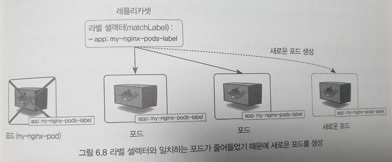    
반대로 수동으로 생성된 pod를 제거하면 Replica Set은 pod를 3개 유지하기 위해 pod를 신규로 생성하여 3개의 pod를 유지한다.  

이번에는 Replica Set에 있는 spec.template.metadata.labels.app를 제거해보자.  
pod의 label이 제거되는 경우 Replica Set은 label이 없는 pod는 관리대상으로 취급하지 않게 되어 Replica Set을 제거해도 해당 pod는 삭제되지 않고 남아있게 된다.  
이를 통해 Replica Set의 목적이 무엇인지 생각해 볼 수 있는데, Replica Set의 목적은 pod의 생성이 아닌 일정한 갯수의 pod를 관리하기 위한 용도로 사용된다고 생각할 수 있다.  
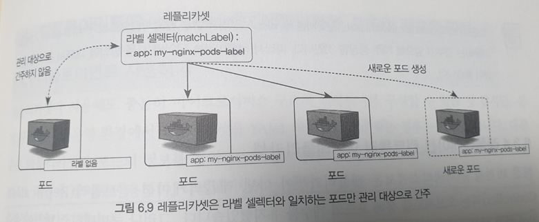  

### Replication Controller vs Replica Set
Replication Controller은 이전 k8s의 버전에서 사용되었다 Replica Set의 이전 버전이라고 생각하면 되며, 현재는 deprecated되어 더 이상 사용되지 않는다.  

# Deployment : Replica Set, pod의 배포 관리
앞서 k8s에서 사용하는 pod와 Replica Set에 대해서 알아보았다.  
pod와 Replica Set을 사용하여 마이크로서비스 구조의 컨테이너를 구성할 수 있을 것 같지만 실제 사용하는 경우 Deployment를 사용한다.  
Deployment는 Replica Set의 상위 개념으로 Deployment를 생성하면 이에 대응하는 Replica Set도 함께 생성된다.  
Deployment를 생성하는 yaml 파일을 통해 알아보도록 하자.  
```yaml
apiVersion: apps/v1
kind: Deployment
metadata:
  name: my-nginx-deployment
spec:
  replicas: 3
  selector:
    matchLabels:
      app: my-nginx
  template:
    metadata:
      name: my-nginx-pod
      labels:
        app: my-nginx
    spec:
      containers:
      - name: nginx
        image: nginx:1.10
        ports:
        - containerPort: 80
```
해당 yaml 파일을 통해 생성된 pod와 Replica Set을 살펴보면 아래와 같다.  
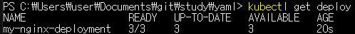  
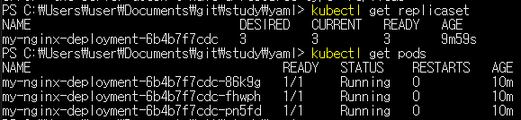  

### Deployment를 사용해야 하는 이유
앞서 yaml을 통해 살펴본 결과 Replica Set를 사용하는 것과 크게 다를 것이 없어 보이는데, Deployment를 사용해야 하는 이유는 무엇일까  
- Application의 업데이트와  배포를 더욱 편하게 해줌
- Deployment는 Application을 배포, 관리하는 역할로 Replica Set에 대한 업데이트 전략을 지정하는 등의 설정이 가능

예를 들어 Deployment를 통해 관리하는 Application에서 image의 version이 변경된 것을 가정해보자.  
이 때 Deployment를 배포하며 --record 옵션을 추가한다.  
다음으로 image version 변경을 위해 아래의 명령어를 실행  
```bash
kubectl set image deployment my-nginx-deployment nginx=nginx:1.11 --record
```
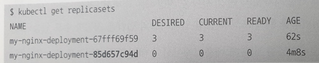  
명령어를 사용한 후 replicasets를 확인하면 2개의 replicasets가 존재하는 것을 확인할 수 있는데, 이는 nginx:1.10 version의 replica set과 nginx:1.11 version의 replicas set를 뜻한다.  
앞서 설정한 --record 설정은 무엇을 나타낼까 --record는 해당 버전의 변경 사항을 기록해 두는 옵션으로 추후 롤백 등의 작업을 수행할 수 있도록 한다.  

앞서 나왔던 개념들을 정리해보면 Deployment > Replica Set > pod 순으로 점점 개념이 커지며, 각각 하위에 해당하는 개념을 관리하는 용도로 사용되는 것을 알 수 있다.  

# Service : pod를 연결하고 외부에 노출
앞서 살펴본 pod, Replica Set, Deployment를 살펴보았다.  
그렇다면 이런 오브젝트에 접근하기 위해서는 어떻게 해야할까?  
k8s에서의 pod, Replica Set, Deployment
- IP가 영속적이지 않아 항상 변할 수 있음
- 여러 개의 Deployment를 하나의 완벽한 애플리케이션으로 연동하기 위해 IP가 아닌 발견(Discovery)할 수 있는 방법 필요
k8s에서는 Service라는 오브젝트를 통해 pod, Replica Set, Deployment에 접근할 수 있도록 설정할 수 있다.  
앞서 docker의 경우 container를 생성할 때 -p 옵션을 사용하여 외부 네트워크와 연결할 수 있었지만 k8s의 경우 해당 방법으로는 pod와 통신할 수가 없고 내부적으로 사용하는 port에 대해서만 정의가 가능  
앞서 살펴본 deployment의 예를 통해 살펴보면 containerPort를 확인할 수 있는데, 여기서 지정된 80은 Nginx의 웹 port를 나타낸다.  
그러나 80 port가 앞서 이야기한 것처럼 외부 네트워크와 연결되는 port는 아니며 service 오브젝트를 사용하여 연결이 필요하다. service의 주요 기능은 다음과 같다.  
- 여러 개의 pod에 쉽게 접근할 수 있도록 고유한 도메인 이름 부여
- 여러 개의 pod에 접근할 때 요청을 분산하는 로드 밸런서 기능 수행
- 클라우드 플랫폼의 로드 밸런서, 클러스터 노드의 포트 등을 통해 pod를 외부에 노출

## Service의 종류
실습을 위해 deployment를 생성한다.  
```yaml
apiVersion: apps/v1
kind: Deployment
metadata:
  name: hostname-deployment
spec:
  replicas: 3
  selector:
    matchLabels:
      app: webserver
  template:
    metadata:
      name: my-webserver
      labels:
        app: webserver
    spec:
      containers:
      - name: my-webserver
        image: alicek106/rr-test:echo-hostname
        ports:
        - containerPort: 80
```
배포된 deployment의 IP를 확인해보자
```bash
kubectl get pods -o wide
```
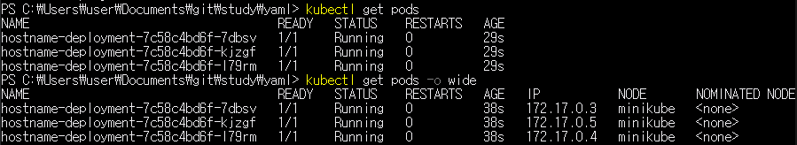  
pod에 어떻게 접근할 것이냐에 따라 종류가 여러 개로 세분화되기 때문에 적절한 서비스 종류 선택하여 사용한다.
- ClusterIP : k8s 내부에서만 pod들에 접근할 때 사용, 외부로 pod를 노출하지 않기 때문에 k8s 클러스터 내부에서만 사용되는 pod에 적합
- NodePort : pod에 접근할 수 있는 port를 모든 노드에 동일하게 개방, 외부에서 pod에 접근할 수 있는 서비스 타입
- LoadBalancer : 클라우드 플랫폼에서 제공하는 Load Balaner를 동적으로 프로비저닝해 pod에 연결하며 NodePort와 마찬가지로 외부에서 pod에 접근할 수 있는 서비스 타입 일반적으로 AWS, GCP 등과 같은 클라우드 플랫폼 환경에서만 사용 가능

### ClusterIP
먼저 ClusterIP 서비스에 대해서 알아보도록 하자.
```yaml
apiVersion: v1
kind: Service
metadata:
  name: hostname-svc-clusterip
spec:
  ports:
    - name: web-port
      port: 8080
      targetPort: 80
  selector:
    app: webserver
  type: ClusterIP
```
ClusterIP 서비스는 위와 같은 yaml 파일 형식으로 정의할 수 있다. 주요 항목에 대해 살펴보자.
- spec.select : 이 서비스에서 어떠한 라벨을 가지는 pod에 접근할 수 있게 만들지는 결정한다.  
- spec.ports.port : 생성된 서비스는 k8s 내부에서만 사용할 수 있는 고유한 IP를 할당받는데 여기서 정의된 port를 사용해 서비스의 IP에 접근할 때 사용하는 port를 정의
- spec.ports.targetPort : selector 항목에서 정의한 라벨에 의해 접근 대상이 된 pod들이 내부적으로 사용하고 있는 port를 입력 앞서 deployment-hostname.yaml에서 containerPort를 80으로 설정했기 때문에 같은 값을 사용  
- spec.type : 서비스의 type에 대해 정의하며, 앞서 살펴본 ClusterIP, NodePort, LoadBalance를 선택할 수 있다.  

ClusterIP는 k8s 내부의 클러스터에서만 사용할 수 있는 내부 IP로 외부와는 통신할 수 없다.  
외부와는 연결할 수 없기 때문에 테스트 역시 pod를 생성해 진행하며 service는 내부적으로 연결된 pod에 Load Balnacer가 적용되어 전달된다.  
또한, 내부 서비스와 통신하는 경우 서비스의 이름과 같은 domain name를 사용하여 통신하는 것이 일반적으로 IP를 아는 것이 아닌 service 명으로 pod에 접근하는 것이 가능하다.  
이는 k8s 내부에 DNS가 구동되고 있기 때문이며, DNS로 인해 pods간 통신시 pod의 IP를 몰라도 서로 통신이 가능하다.

생성된 service 확인
```bash
kubectl get service
kubectl get svc
```
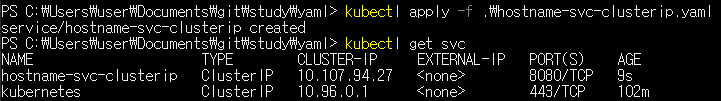  

ClusterPort 생성 과정과 동작 방식에 대해 알아보자.  
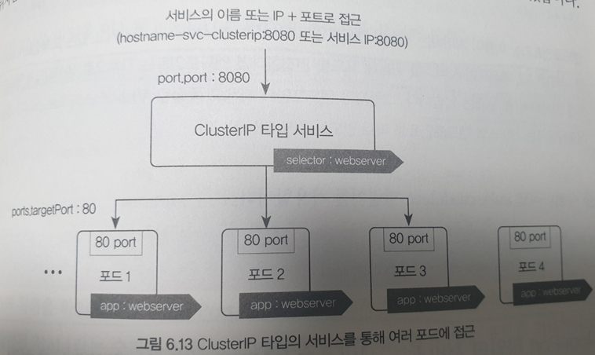  
1. 특정 라벨을 가지는 pod를 서비스와 연결하기 위해 서비스의 yaml 파일의 selector항목 정의
2. pod에 접근할 때 사용하는 port를 yaml 파일의 targetPort 항목에 정의
3. 서비스를 생성할 때 yaml 파일의 port 항목에 8080을 명시해 서비스의 Cluster IP와 8080 port로 접근할 수 있게 설정
4. kubectl apply -f 명령어로 ClusterIP 타입의 서비스가 생성되면 서비스는 k8s 클러스터 내부에서만 사용 가능한 고유 IP 할당
5. k8s 클러스터에서 서비스의 내부 IP 또는 서비스 이름으로 pod에 접근

### NodePort
ClusterIP의 경우 k8s의 내부에서만 접근 가능하지만, 외부에서 접근을 허용해야 하는 경우도 존재한다. NodePort 서비스는 클러스터 외부에서 접근할 수 있도록 허용할 수 있으며, 서비스의 모든 Node의 특정 port를 개방하여 서비스에 접근하는 사용된다.  
```yaml
apiVersion: v1
kind: Service
metadata:
  name: hostname-svc-nodeport
spec:
  ports:
    - name: web-port
      port: 8080
      targetPort: 80
  selector:
    app: webserver
  type: NodePort
```
NodePort와 ClusterIP의 설정의 차이는 spec.type가 ClusterIP -> NodePort로 변경된 것 이외에 모두 동일하게 사용할 수 있다.  
위의 nodeport service를 생성한 후 아래의 명령어를 통해 생성을 확인한다.  
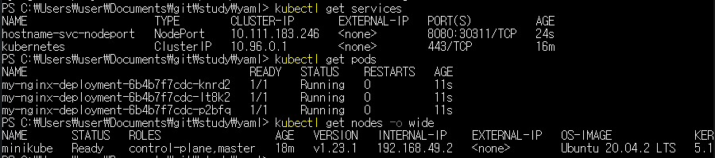  
NodePort의 작동방식에 대해 정리해보자.  
  
1. 외부에서 pod에 접근하기 위해 각 노드에 개방된 port로 요청 전송 위의 예제의 경우 31514 port로 들어온 요청은 서비스와 연결된 pod 중 하나로 라우팅
2. 클러스터 내부에서는 ClusterIP 타입의 서비스와 동일하게 접근  

이렇게 ClusterIP와 NodePort를 통해 내외부에서 pod에 접근이 가능하도록 설정할 수 있지만 NodePort 역시 실 서비스에서 자주 사용되는 형식은 아닌데, Nodeport를 사용하는 경우 단점은 아래와 같다.  
- port를 80 또는 443로 설정하기 적절하지 않음
- SSL인증서 적용, 라우팅 등과 같은 복잡한 설정을 서비스에 적용하기 어렵다.

위와 같은 단점들로 인해 k8s에서는 Ingress라는 오브젝트를 사용하는 경우가 많으며 이는 추후에 다시 알아보도록 하자.

### LoadBalancer
LoadBalancer 서비스는 생성과 동시에 LoadBalancer를 새롭게 생성해 pod와 연결되며 클라우드 플랫폼으로부터 도메인 이름과 IP를 할당받기 때문에 NodePort보다 더욱 쉽게 pod에 접근 할 수 있지만 LoadBalancer를 동적으로 생성하는 기능을 제공하는 환경에서만 사용 가능하다는 것을 유의해야한다.  
LoadBalancer를 생성하는 yaml 파일을 살펴보자
```yaml
apiVersion: v1
kind: Service
metadata:
  name: hostname-svc-lb
spec:
  ports:
    - name: web-port
      port: 80
      targetPort: 80
  selector:
    app: webserver
  type: LoadBalancer
```
이전과 다른 점에 대해서 살펴보면, spec.ports.port가 80으로 type가 LoadBalancer로 변경되었다. LoadBalancer에서의 port는 LoadBalancer에 접근하기 위한 port를 의미하기 때문에 여기서는 80으로 변경되었다는 것을 알아두자.
LoadBalancer 서비스가 잘 생성되었는지 확인해보자.  
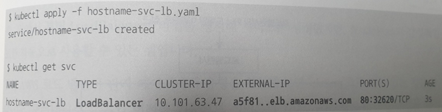  

LoadBalancer의 동작방식
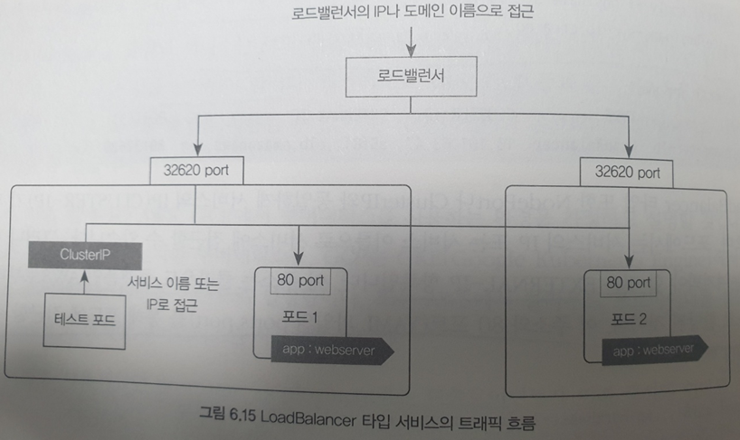  
1. LoadBalancer는 서비스가 생성됨과 동시에 모든 워커 노드는 pod에 접근할 수 잇는 랜덤판 port를 개방
2. 클라우드 플랫폼에서 생성된 LoadBalancer로 요청이 들어오면 k8s의 워커 노드 중 하나로 전달되며 이 때 사용되는 port는 1번에서 개방된 port 사용
3. 워커 노드로 전달된 요청은 pod중 하나로 전달되어 처리

