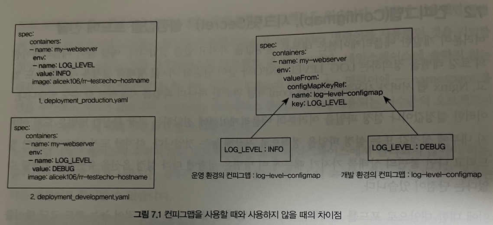
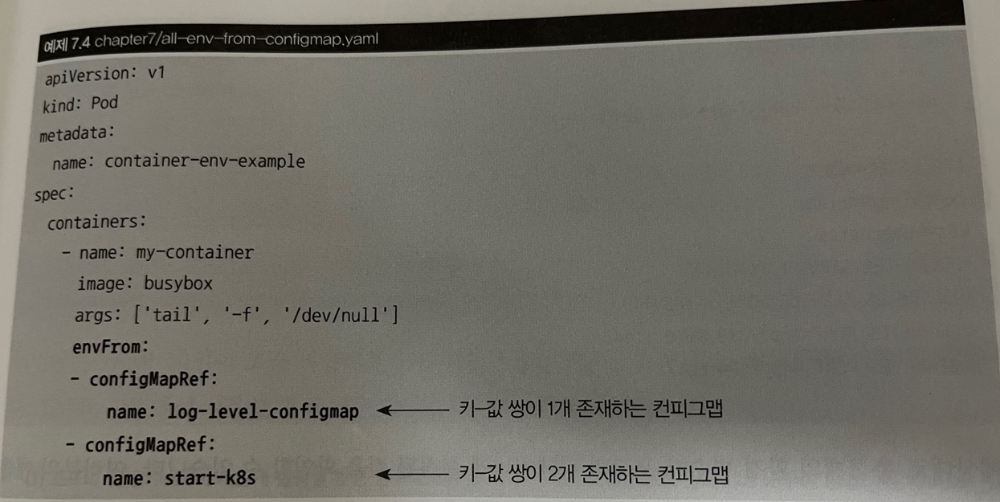
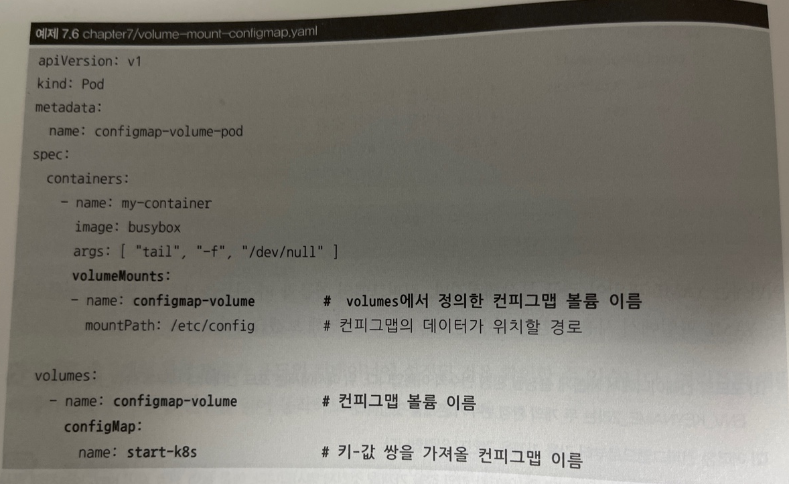

# 쿠버네티스 리소스의 관리와 설정
애플리케이션을 관리하기 위해 자주 사용되는 네임스페이스(namespace), 
컨피그맵(configmap), 시크릿(secret)을 알아보자

## 네임스페이스(namespace)
리소스를 논리적으로 구분하는 오브젝트이다.  
네임스페이스는 포드, 레플리카셋, 디플로이먼트, 서비스 등과 같은 
쿠버네티스 리소스들이 묶여있는  하나의 가상공간또는 그룹  
용도는 대부분 모니터링, 로드밸런싱, 인그레스등의 목적  
논리적으로 구분은 되지만 물리적으로 구분되지는 않음 라벨과 비슷

```
#네임스페이스 목록
kubectl get namespaces

#namespace를 ns,n라는 줄임말로도 사용 가능
kubectl get ns,kubectl get n  
  
 
```

네임스페이스를 생성하지 않았더라도 기본저긍로 3개의 네임스페이스가 존재함  
### default
```
#default 네임스페이스 
kubectl get pods --namespace default
```
쿠버네티스를 설치하면 자동으로 사용하도록 설정되는 네임스페이스
### kube-public
```
kube-system 네임스페이스
kubectl get pods -n kube-system
```
쿠버네티스 클러스터 구성에 필수적인 컴포넌트들과 설정값등이 존재하는 네임스페이스  

### kube-system
```
kube-system 네임스페이스
kubectl get service -n kube-system
```

네임스페이스와 라벨의 차이점  
라벨보다 더욱 넓은 용도로 사용할 수 있다.  
ex) ResourceQuota라는 오브젝트로 포드의 자원 사용량 제한,  
애드미션컨트롤러로 포드에 사이드카 컨테이너를 붙일수있다.  
무엇보다 쿠버네티스에서의 사용 목적에 따라 포드, 서비스 등의 리소스를 격리함으로써 편리하게 구분할수있다.  

## 네임스페이스 사용하기 

production-namespace.yaml 파일생성
```
apiVersion: v1
kind: Namespace
metadata:
  name: production
```
```
#yaml파일로 네임스페이스 생성
kubectl apply -f production-namespace.yaml

#kubectl create namespace명령어로 생성
kubectl create namespace production
```
네임스페이스에 디플로이먼트, 서비스 생성하기 YAML
```
apiVersion: apps/v1
kind: Deployment
metadata:
  name: hostname-deployment-ns
  namespace: production <--
spec:
  replicas: 1
  selector:
    matchLabels:
      app: webserver
  template:
    metadata:
      name: my-webserver
      labels:
        app: webserver
    spec:
      containers:
      - name: my-webserver
        image: alicek106/rr-test:echo-hostname
        ports:
        - containerPort: 80
---
apiVersion: v1
kind: Service
metadata:
  name: hostname-svc-clusterip-ns
  namespace: production <--
spec:
  ports:
    - name: web-port
      port: 8080
      targetPort: 80
  selector:
    app: webserver
  type: ClusterIP
```
```
모든 네임스페이스의 리소스 확인하기
kubectl get pods --all-namespaces
```

### 네임스페이스의 서비스에 접근하기
같은 네임스페이스 내의 서비스에는 서비스 이름만으로 접근 가능  
But, 다른 네임스페이에 존재하는 서비스에는 서비스 이름만으로 접근 불가능  
-> 서비스이름.네임스페이스이름.svc 로 다른 네임스페이스의 서비스에도 접근 가능

ex) production 네임스페이스에 있는 hostname-scv-clusterip-ns 라는 서비스에 접근하기
```
curl hostname-svc-clusterip-ns.production.svc:8080 -- slient | grep Hello
```

A 네임스페이스에서 포드를 만들면 B 네임스페이스에서는 보이지 않는다  
== '오브젝트가 네임스페이스에 속한다' namespaced   

네임스페이스에 속하는 오브젝트 종류 확인  
kubectl api-resources --namespaced=true


## 컨피그맵(Configmap)
설정값이나 설정 파일을 애플리케이션에 전달하려면 내부에 설정값 또는 설정 파일을 정적으로 저장해두는것입니다.  

포드의 LOG_LEVEL이라는 이름의 환경 변수를 INFO라는 값으로 설정
env-hard-coding-deployment.yaml
```
spec:
    containers:
    -name : nginx
     env :
      - name: LOG_LEVEL
        value: INFO
      image: nginx:1.10
```

컨피그맵을 사용할 때와 사용하지 않을 때의 차이점
  
왼쪽의 포드의 YAML 파일에 환경 변수를 각각 정의해 사용하면 두개의 파일이지만  
오른쪽처럼 컨피그맵을 사용하면 한개의 포드 YAML 파일만을 사용하되 환경에 따라  
다른 컨피그맵을 생성해서 사용하면된다.

### 컨피그맵 생성
1. --from-literal 옵션 사용
kubectl create configmap <컨피그맵 이름> <각종 설정값들>
```
#from-literal사용
kubectl create configmap log-level-configmap --from-literal LOG_LEVEL=DEBUG

kubectl create configmap start-k8s --from-literal k8s=kubernetes \
--from-literal container=docker

#컨피그맵 가져오기
kubectl get configmap       #configmap 대신 cm도가능

#from-file사용
kubectl create configmap index-file --from-file index.html // 키는 index.html이 된다
kubectl create configmap index-file --from-file myindex=index.html // 키는 myindex가 된다
```
2. --from-file 옵션 사용
컨피그맵에 저장된 설정값 가져오기
```
kubectl describe configmap log-level-configmap
kubectl get configmap log-level-configmap -o yaml
```


### 컨피그맵의 값을 컨테이너의 환경 변수로 사용  

위에서 생성한 log-level-configmap, start-k8s 두개의 컨피그맵으로부터 값을 가져와  
환경변수를 생성


```
#생성
kubectl apply -f all-env-from-configmap.yaml


kubectl exec container-env-example env
..
LOG_LEVEL=DEBUG
container=docker
k8s-kubernetes
KUBERNETES_SERVICE_PORT=443
KUBERNETES_SERVICE_PORT_HTTPS=443
KUBERNETES_PORT=tcp://10.96.0.1:443
KUBERNETES_PORT_443_TCP=tcp://10.96.0.1:443
```
이렇게 세개의 환경 변수가 포드의 컨테이너에 설정이된다.

configMapKeyRef를 사용하면 여러개의 key-value쌍이 들어있는  
컨피그맵에서 특정데이터만을 선택해 가져올수있다.
```
env:
- name: ENV_KEYNAME_1           #컨테이너에 새롭게 등록될 환경 변수이름
    valueFrom:
        configMapKeyRef:
            name: log-level-configmap
            key: LOG_LEVEL
- name: ENV_KEYNAME_2           #컨테이너에 새롭게 등록될 환경 변수이름
    valueFrom:
        configMapKeyRef:
            name: start-k8s     #참조할 컨피그맵의 이름
            key: k8s            #가져올 데이터 값의 키

#최종결과 ->ENV_KEYNAME_2=$(k8s 키에 해당하는값)
```

컨피그맵의 값을 포드 내부의 파일로 마운트해 사용

spec.volumens: YAML 파일에서 사용할 볼륨의 목록을 정의
spec.containers.volumeMounts : volumes 항목에서 정의된 볼륨을 컨테이너 내부의 어떤  
디렉토리에 마운트할 것인이 명시  

마운트로 포드 생성 후 확인
```
#생성
kubectl apply -f volume-mount-configmap.yaml

kubectl exec configmap-volume-pod ls /etc/config
container
k8s

kubectl exec configmap-volume-pod cat /etc/config/k8s
kubernetes
```
위처럼 컨피그맵과 같은 쿠버네티스 리소스의 데이터를 포드 내부 디렉터리에 위치시키는것을  
쿠버네티스 공식 문서에서는 투사(Projection)한다고 표현합니다.

### 컨피그맵에 존재하는 특정 키-값 쌍을 디렉터리에 마운트하는 YAML
```
apiVersion: v1
kind: Pod
metadata:
  name: selective-cm-volume-pod 
spec:
  containers:
    - name: my-container
      image: busybox
      args: [ "tail", "-f", "/dev/null" ]
      volumeMounts:
      - name: configmap-volume
        mountPath: /etc/config       # 마운트되는 위치는 변경되지 않았습니다.
  volumes:
    - name: configmap-volume
      configMap:
        name: start-k8s
        items:                       # 컨피그맵에서 가져올 키-값의 목록을 나열합니다.
        - key: k8s                    # k8s라는 키에 대응하는 값을 가져옵니다.
          path: k8s_fullname         # 최종 파일 이름은 k8s_fullname이 됩니다
```
items: 컨피그맵에서 가져올 키-값 목록을 의미  
path: 디렉토리에 위치할 파일 이름을 명시  

마운트로 포드 생성 후 확인
```
$ kubectl exec selective-cm-volume-pod ls /etc/config
k8s_fullname

$ kubectl exec selective-cm-volume-pod cat /etc/config/k8s_fullname
kubernetes
```

변수로 넣는법 말고 --from-env-file로 파일자체를 넣어서 컨피그맵으로 가져올수있다.

## 시크릿
SSH키 비밀번호 등과 같이 민감한 정보를 저장하기 위한 용도로 사용  
사용법은 컨피그맵과비슷

```
kubectl create secret generic my-password --from-literal password=1q2w3e4r

echo mypassword > pw1 && echo yourpassword > pw2
kubectl create secret generic our-password --from-file pw1 --from-file pw2
```
시크릿은 컨피그맵과 달리 데이터의 사용 목적에 따라 몇가지 종류로 나뉨

```
kubectl describe secret my-password
password: 8 bytes

kubectl get secret my-password -o yaml
data:
    password: MXEydzNlNHI=
```
컨피그맵과 비스산 형식으로 데이터가 저장돼 있지만, 키-값 쌍에서 값에  
해당하는 부분이 이상한값으로 변형돼있음 MXEydzNlNHI=는 1q2w3e4r이 base64로 인코딩한값  
--dry-run -o로 확인해보면 맞게 나와있음

컨피그맵ref와같이 시크릿도 secretRef가 존재
```
envFrom:
- secretRef:
    name: my-password
```
동일하게 사용가능하고 key, name도 사용가능