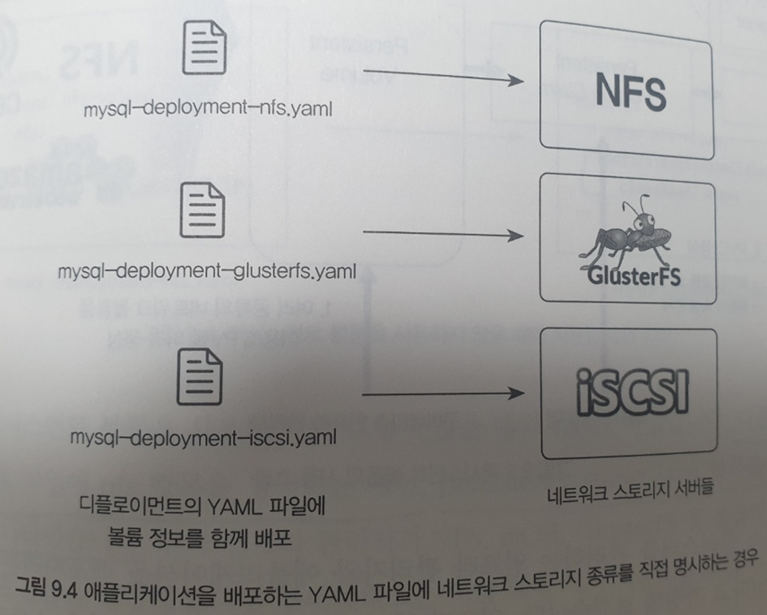
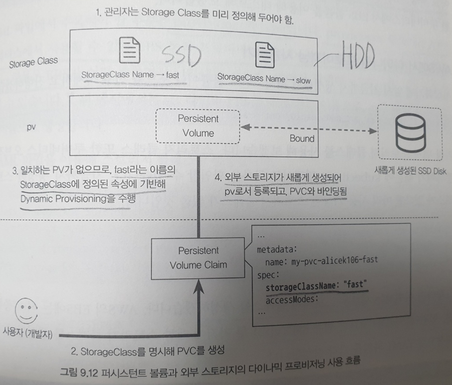

# 퍼시스턴트 볼륨(PV)과 퍼시스턴트 볼륨 클레임(PVC)

앞서 사용했던 디플로이먼트는 모두 상태가 없는(stateless) 애플리케이션으로 별도의 데이터를 가지고 있지 않고, 응답에 대한 요청만 반환하며, 디플로이먼트를 삭제하는 경우 데이터가 모두 삭제되었다.  
그러나 DB 등의 상태가 있는(stateful) 애플리케이션의 경우 데이터를 어떻게 관리하늘지 고민해야한다.  
docker에서는 이를 -v 옵션을 사용하여 host에 있는 볼륨과 공유하는 방식을 사용할 수 있지만, k8s에서는 클러스터 형식으로 사용되기 때문에 이를 적절한 방법이 아니다.  
k8s는 워커 노드 중 하나를 선택해 pod를 할당하는데, 특정 노드에서만 데이터를 보관해 저장하면 pod가 다른 노드로 옮겨갔을 경우 해당 데이터를 사용할 수 없게 되기 때문이다.  
이런 문제를 해결하기 위해 k8s에서는 PV(Persistent Volume)를 사용할 수 있다.  

### PV란
워커 노드들이 네트워크 상에서 스토리지를 마운트해 영속적으로 데이터를 저장할 수 있는 볼륨  
pod에 장애가 생겨 다른 노드로 이동하는 경우에도 데이터를 계속해서 사용할 수 있음.  
  

## 로컬 볼륨: hosPath, emptyDir
PV를 알아보기 전 볼륨을 간단하게 사용할 수 있는 hostPath와 emptyDir 두 가지 종류에 대해서 먼저 알아보도록 하자.  
- hostPath : host와 볼륨을 공유하기 위해 사용
- emptyDir : pod의 컨테이너 간 볼륨을 공유하기 위해 사용

이는 자주 사용되는 방법은 아니며, PV에 대해 알아보기 전 연습하는 느낌으로 알아보자.  

### 워커 노드의 로컬 디렉터리를 볼륨으로 사용 : hostPath
pod의 데이터를 보존하는 가장 간단한 방법으로 host의 디렉토리를 pod와 공유해 데이터를 저장하는 방식
```yaml
apiVersion: v1
kind: Pod
metadata:
  name: hostpath-pod
spec:
  containers:
    - name: my-container
      image: busybox
      args: [ "tail", "-f", "/dev/null" ]
      volumeMounts:
      - name: my-hostpath-volume
        mountPath: /etc/data
  volumes:
    - name: my-hostpath-volume
      hostPath:
        path: /tmp
```
- spec.containers.name.volumeMounts.name : 볼륨의 이름
- spec.containers.name.volumeMounts.mountPath : pod 볼륨의 위치
- spec.volumes.name.hostPath.path : host 디렉토리 위치

위의 yaml은 host의 /tmp와 pod의 /etc/data가 연결된다는 의미로 pod의 /etc/data에 어떤 파일이나 작업을 하면 host의 /tmp에도 동일한 파일이 생기고 수정된다.  
이 방법은 앞서 언급한 것 처럼 pod에 장애가 발생하여 재시작되는 경우 어떤 노드에서 재시작될지 보장할 수 없기 때문에 권장되는 방법이 아니며, host에 장애가 발생하면 데이터를 잃을 수도 있다.  
hostPath 방식은 각 pod를 모든 노드에 배치해야하는 경우에 사용할 수 있으며 모니터링 툴인 CAdvisor 같은 경우 hostPath를 이용해 데이터를 수집한다.  

### 포드 내의 컨테이너 간 임시 데이터 공유 : emptyDir
emptyDir 볼륨은 포드의 데이터를 영속적으로 보존하기 위해 외부 볼륨을 사용하는 것이 아닌 pod가 실행되는 도중에만 필요한 휘발성 데이터를 각 컨테이너가 함께 사용할 수 있도록 하는 임시 저장공간  
pod가 삭제되면 emptyDir에 있는 데이터도 함께 삭제
```yaml
apiVersion: v1
kind: Pod
metadata:
  name: emptydir-pod
spec:
  containers:
  - name: content-creator
    image: alicek106/alpine-wget:latest
    args: ["tail", "-f", "/dev/null"]
    volumeMounts:
    - name: my-emptydir-volume
      mountPath: /data                      # 1. 이 컨테이너가 /data 에 파일을 생성하면

  - name: apache-webserver
    image: httpd:2
    volumeMounts:
    - name: my-emptydir-volume
      mountPath: /usr/local/apache2/htdocs/  # 2. 아파치 웹 서버에서 접근 가능합니다.

  volumes:
    - name: my-emptydir-volume
      emptyDir: {}                             # 포드 내에서 파일을 공유하는 emptyDir
```
위의 yaml 파일에는 container이 총 2개 정의되어 있다 content-creator에서 /data에 컨텐츠를 생성하면 apache-webserver에서 /usr/local/apache2/htdocs를 통해 접근할 수 있으며, 이를 통해 외부에 제공되는 방식이다.  
  
emptyDir은 github의 소스를 받아 공유하는 사이드카 컨테이너 형식으로 활용하거나 설정 파일을 동적으로 갱신하는 컨테이너 등으로 활용할 수 있다.  

## 네트워크 볼륨
k8s에서는 네트워크 상에 존재하는 저장소를 볼륨으로 사용할 수 있다.  
- NFS
- iSCSI
- GlusterFS
- Ceph
- AWS의 EBS(Elastic Block Storage)
- GCP의 gcePersistentDisk

  

네트워크 볼륨의 경우 위치는 특별히 정해지지 않으며, 네트워크로 접근할 수 있다면 k8s 클러스터 내부, 외부 어느곳에 존재해도 상관 없다.

### NFS 사용하기
NFS(Network File System)은 대부분의 운영체제에서 사용할 수 있는 네트워크 스토리지로 여러 개의 클라이언트가 동시에 마운트해 사용할 수 있다.  
다른 솔루션에 비해 안정성은 떨어지나 하나의 서버만으로 간편하게 사용할 수 있으며, NFS를 마치 로컬스토리지처럼 사용할 수 있는 장점이 있다.  
NFS를 사용하기 위해서는 NFS서버와 클라이언트가 필요한데, k8s에서는 pod들이 클라이언트가 된다.  
서버는 따로 구축해야 하지만 여기서는 k8s에 생성해 사용해보자.  
```yaml
apiVersion: apps/v1
kind: Deployment
metadata:
  name: nfs-server
spec:
  selector:
    matchLabels:
      role: nfs-server
  template:
    metadata:
      labels:
        role: nfs-server
    spec:
      containers:
      - name: nfs-server
        image: gcr.io/google_containers/volume-nfs:0.8
        ports:
          - name: nfs
            containerPort: 2049
          - name: mountd
            containerPort: 20048
          - name: rpcbind
            containerPort: 111
        securityContext:
          privileged: true
---------------------------------------------------------
apiVersion: v1
kind: Service
metadata:
  name: nfs-service
spec:
  ports:
  - name: nfs
    port: 2049
  - name: mountd
    port: 20048
  - name: rpcbind
    port: 111
  selector:
    role: nfs-server
```
위의 yaml 파일은 nfs를 사용하기 위한 서비스와 디플로이먼트이며, 접근하기 위한 NFS 클라이언트 pod는 아래와 같이 정의한다.  
```yaml
apiVersion: v1
kind: Pod
metadata:
  name: nfs-pod
spec:
  containers:
    - name: nfs-mount-container
      image: busybox
      args: [ "tail", "-f", "/dev/null" ]
      volumeMounts:
      - name: nfs-volume
        mountPath: /mnt           # 포드 컨테이너 내부의 /mnt 디렉터리에 마운트합니다.
  volumes:
  - name : nfs-volume
    nfs:                            # NFS 서버의 볼륨을 포드의 컨테이너에 마운트합니다.
      path: /
      server: {NFS_SERVICE_IP}
```
클라이언트에서는 nfs를 mount하기 위해 path와 nfs의 서버 IP를 지정하여 생성되며, /mnt 내부에 파일을 생성하면 nfs 서버에 데이터가 저장된다.  
여기서 주의해야하는 점은 NFS의 볼륨 마운트는 컨테이너 내부가 아닌 워커 노드에서 발생하느로 Service Discovery를 사용할 수 없어 IP를 사용해야 한다는 점이다.  
k8s에서 제공하는 Service Discovery 기능은 오직 pod 내부에서만 사용이 가능하다.  
이렇게 NFS를 사용하는 경우 pod가 종료되어도 NFS에 저장된 데이터는 삭제되지 않고 보존된다.  
NFS도 실제 상용 서비스에서는 잘 사용되지 않는데, 백업 스토리지를 구축하여 NFS자체의 데이터 손실을 대비하는 등의 작업이 필요하기 때문에 테스트 용도로 자주 사용  

## PV, PVC를 이용한 볼륨 관리
### PV와 PVC를 사용하는 이유
지금까지 k8s를 사용하며 object들을 모두 yaml 파일로 정의하고 사용했다.  
NFS의 경우에도 NFS에 대한 정의를 yaml 파일 내부에 작성했으며, 이는 개인이 테스트하는데는 문제가 없지만, 배포를 해야하는 경우 확장성과 자유도가 떨어진다.  
  
이런 점을 해소하기 위해 k8s에서는 PV와 PVC를 제공하며 이는 네트워크 볼륨에 대한 자유도를 높여준다.  
실제 PV의 동작 방식에 대해 살펴보자.  

  
1. 인프라 관리자는 네트워크 볼륨의 정보를 이용해 PV 리소스를 미리 생성하며, 여기에는 네트워크 볼륨의 정보와 endpoint가 정의된다.
2. 사용자는 pod를 정의하는 yaml 파일에 이 pod는 데이터를 영속적으로 저장해야하므로 마운트 할 수 있는 외부 볼륨이 필요하다는 의미의 PVC를 명시하여 생성한다.
3. k8s는 기존의 인프라 관리자가 생성해 뒀던 PV의 속성과 사용자가 요청한 PVC의 요청이 일치하는 경우 두 개의 리소스를 매칭시켜 bind하고 pod의 컨테이너 내부에 볼륨이 마운트 된 상태로 생성한다.  

핵심은 **사용자가 yaml 파일에 볼륨의 상세한 스펙을 정의하지 않아도 된다는 것** 이다.  
PVC가 필요하다고 정의할 뿐 어떤 볼륨이 마운트되는지 몰라도 된다.  
  

### PV와 PVC 사용하기
PVC를 사용하기 위해서는 PV에 대한 정의가 먼저 이루어져야 하며, PV로 사용하기 위한 네트워크 스토리지를 먼저 생성해야 한다.  
  
  
```yaml
apiVersion: v1
kind: PersistentVolume
metadata:
  name: ebs-pv
spec:
  capacity:
    storage: 5Gi         # 이 볼륨의 크기는 5G입니다.
  accessModes:
    - ReadWriteOnce    # 하나의 포드 (또는 인스턴스) 에 의해서만 마운트 될 수 있습니다.
  awsElasticBlockStore:
    fsType: ext4
    volumeID: <VOLUME_ID>
```
- kind : PersistentVolume PV Object를 생성한다.
- spec.capacity.storage : 볼륨의 크기 정의
- spec.accessModes.ReadWriteOnce : 하나의 pod 또는 인스턴스에 의해서만 mount 된다.
- spec.awsElasticBlockStore : PV 종류에 대한 정의

이렇게 생성된 PV는 특정 Namespace에 속하지 않으며, 사용자가 PV가 어떤 종류로 구성되어 있는지 몰라도 된다.  
  
PVC를 생성해보자.  
```yaml
apiVersion: v1
kind: PersistentVolumeClaim
metadata:
  name: my-ebs-pvc                  # 1. my-ebs-pvc라는 이름의 pvc 를 생성합니다.
spec:
  storageClassName: ""
  accessModes:
    - ReadWriteOnce       # 2.1 속성이 ReadWriteOnce인 퍼시스턴트 볼륨과 연결합니다.
  resources:
    requests:
      storage: 5Gi          # 2.2 볼륨 크기가 최소 5Gi인 퍼시스턴트 볼륨과 연결합니다.
---
apiVersion: v1
kind: Pod
metadata:
  name: ebs-mount-container
spec:
  containers:
    - name: ebs-mount-container
      image: busybox
      args: [ "tail", "-f", "/dev/null" ]
      volumeMounts:
      - name: ebs-volume
        mountPath: /mnt
  volumes:
  - name : ebs-volume
    persistentVolumeClaim:
      claimName: my-ebs-pvc    # 3. my-ebs-pvc라는 이름의 pvc를 사용합니다.
```
PV와 PVC가 연결되기 위해서는 몇가지 조건이 필요한데, accessMode, storage등이 여기에 속한다.  
앞서 생성한 PV에서 정의한 accessMode와 storage가 모두 만족하면 PVC에 연결된다.  
만약 PVC에서 요청하는 PV가 존재하지 않는다면 pod는 계속해서 Pending 상태로 유지된다.  
예를 들어 PVC는 5Gi를 요청하고 PV는 3Gi 밖에 존재하지 않는다면 bind되지 않고 Pending 상태가 된다.  
이렇게 연결된 PVC는 Namespace에 속하는 object가 된다.  
  
PV는 어느 Namespace에서든 사용할 수 있지만 PVC는 특정 Namespace에 종속된다고 생각하자.  
PVC의 사용법에 대해서 정리해보자.  
  
1. pod의 데이터를 영속적으로 저장하기 위해 AWS에서 EBS 볼륨 생성하고 이를 기록
2. ebs-pv.yaml 파일에서 EBS 볼륨을 이용하여 PV를 생성하고 볼륨의 속성 정의
3. ebs-pod-pvc.yaml 파일에서 PVC에 대한 조건을 정의
4. PVC와 PV의 요구사항을 비교하여 연결

### PV를 선택하기 위한 조건 명시
앞서 PV와 PVC를 사용하기 위해서 실제 요구사항에 대해 맞춰져야 한다는 것을 알게 되었다.  
앞서 살펴본 accessModes와 볼륨 크기 이외에 스토리지 클래스, 라벨 셀렉터 등을 통해서도 연결이 가능하다.  
  
accessMode에는 어떤 종류가 있고 어떤 특징이 있는지 알아보자.
|accessModes|kubectl get에서 출력되는 이름|설명|
|------|---|---|
|ReadWriteOnce|RWO|1:1 마운트 가능, 읽기 쓰기 가능|
|ReadOnlyMany|ROX|1:N 마운트 가능, 읽기 전용|
|ReadWriteMany|RWX|1:N 마운트 가능, 읽기 쓰기 가능|

스토리지 클래스와 라벨 셀렉터를 이용하여 연결하는 것 역시 가능한대,  
앞서 사용한 설정들과 비슷하게 동일한 스토리지 클래스와, 라벨 셀렉터를 bind 시킨다.  
  
  

### PV의 라이프사이클과 Reclaim Policy
PV는 어떤 상태에서 어떻게 상태가 변화되는지 알아보도록 하자.  
pv와 pvc를 확인하기 위해서는 아래의 명령어를 사용한다.  
```bash
kubectl get pv, pvc
```
Status 항목을 통해 PV의 현재 상태를 알 수 있는데
- Available: 사용 가능한 PV
- Bound : PVC에 매핑된 PV
- Released : PVC에 매핑이 해제된 PV

Released에 대해서 좀 더 자세히 알아보자.  
PVC와 연결되었던 PV는 어떻게 처리될까?  
PVC와 연결되었던 PV는 Reclaim Policy에 따라서 처리되며, Default 값인 Retain으로 설정되어 있는 경우 PVC와의 연결이 끊기면 Released 상태로 전환된다.  
Released 상태의 PV는 재사용이 불가능하지만, 데이터는 그대로 보존되어 있기 때문에 PV를 삭제한뒤 다시 생성하여 사용하는 것이 가능하다.  
  

Recliam Policy에는 Retain만 있는 것은 아니다.  
- Retain : PVC와 연결이 끊기면 Released 상태로 전환된다.
- Delete : PVC와 연결이 끊기면 PV도 삭제된다.
- Recyle : PVC와 연결이 끊기면 Available 상태로 전환되고, PV는 재사용이 가능(Deprecated)

  

### StorageClass와 Dynamic Provisioning
앞서 PVC를 사용하기 위해서 PV가 무조건 선행되어야 한다라고 알아보았다.  
PV가 없는 경우 PVC는 할당받지 못하고 PV가 있는지 확인해야하기 때문에 여러 가지 문제가 발생할 수 있다.  
k8s에서는 이를 방지하기 위해 **Dynamic Provisioning** 기능을 제공한다.  
Dynamic Provisioning은 PV를 PVC의 요청에 따라 자동으로 생성해주는 기능으로 요구 사항에 맞춰 PV가 생성된다.  
요구 사항과 PV의 형태의 따라 StorageClass를 사용할 수 있는데, 그림을 통해 살펴보자.  

  
1. fast는 SSD, slow는 HDD를 생성하도록 설정
2. PVC에서는 StorageClass를 명시하여 생성하는데, AccessMode나 Capacity등 조건에 맞는 PV는 존재하지 않는 상태
3. 조건에 일치하는 새로운 PV가 생성되고 StorageClass에 따라 SSD, HDD가 생성
4. PVC-PV binding

Dynamic Provisioning을 사용하면 편리하지만 모든 스토리지에서 제공되는 기능이 아니기 때문에 제공 여부를 잘 확인해야 한다.  


